Building a template
=====================

Receiver Seed location
----------------------

The first step of building a template is defining the location of the receiver seed.

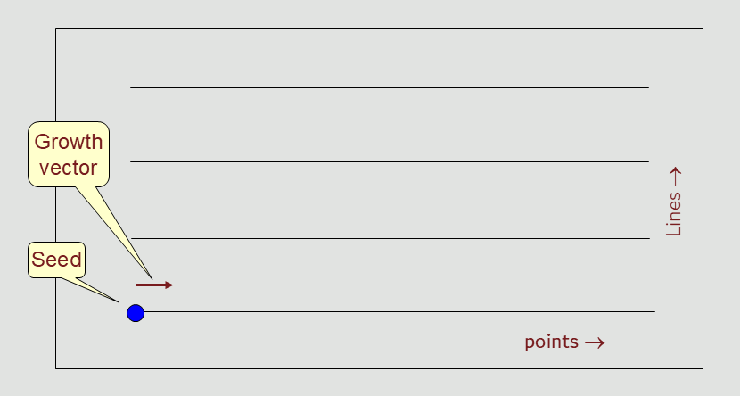

Receiver Seed - inline growth
----------------------------

The next step is to 'grow' that seed in the inline direction, defining the point interval and the length of the active spread

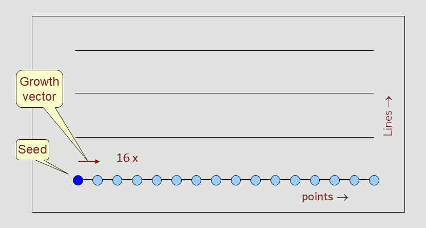

Receiver Seed - crossline growth
---------------------------------

The following step is to 'grow' that seed in the crossline direction, defining the line intervals and the width of the active spread

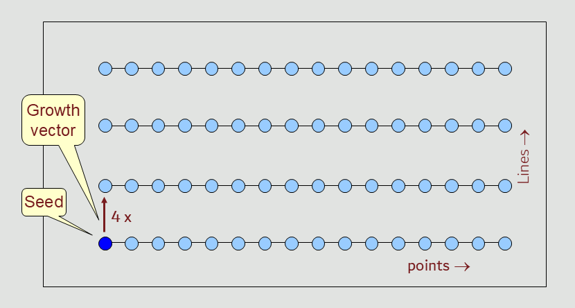

The spread defined in these two steps consists of 16 x 4 = 64 receiver points

Source Seed location
---------------------

The following step is to add a source seed to the template.

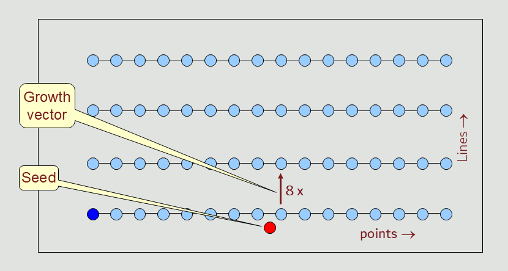

Source Seed - crossline growth
----------------------------

The next step is to 'grow' the source seed in the crossline direction, defining the point interval and the length of the source salvo

.. note::

   Inline refers to the direction of the receiver line; crossline refers to the direction orthogonal to the receiver line.

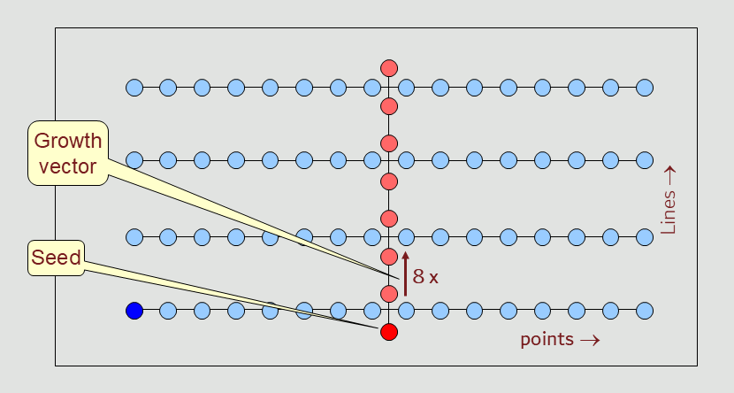

Completed template
---------------------

After defining at least one source seed and one receiver seed, and applying the growth steps to these seeds, the template is complete.

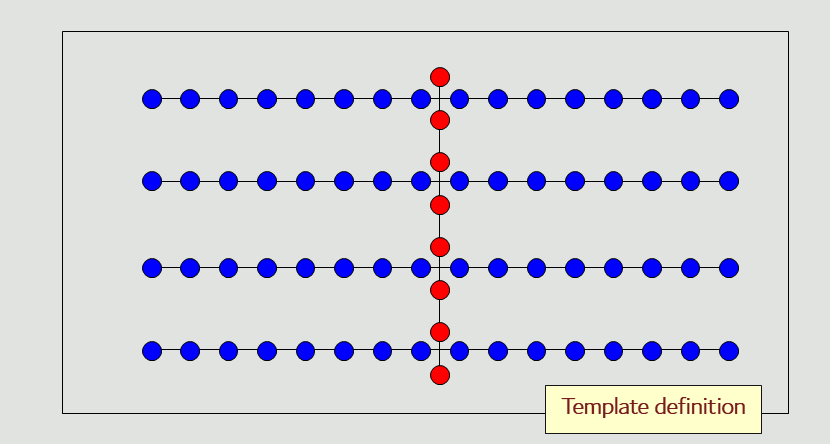

Roll along
----------

The completed template is the starting point for rolling the survey geometry.

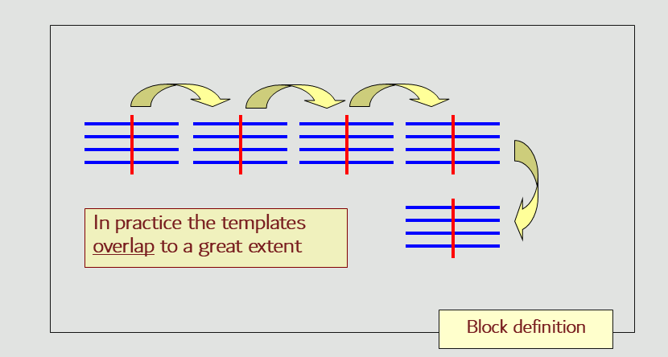

Survey Block
----------------

The overlapping templates together make up the survey geometry within a survey block.

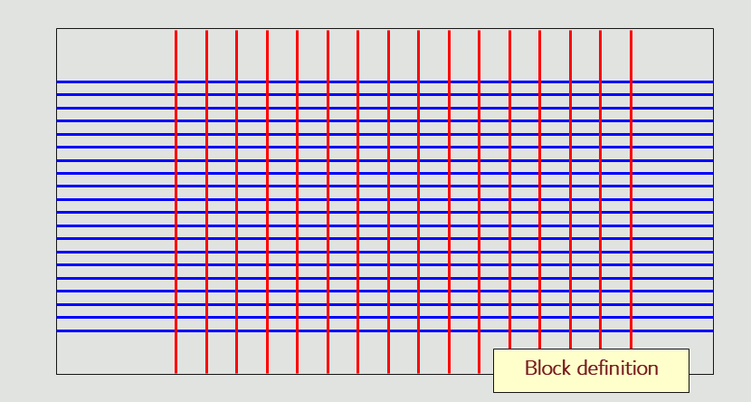

Block boundaries
----------------
It is very rare that surveys taper in and taper out using complete templates. Usually, (*separate*) block boundaries are applied to the sources and the receivers.

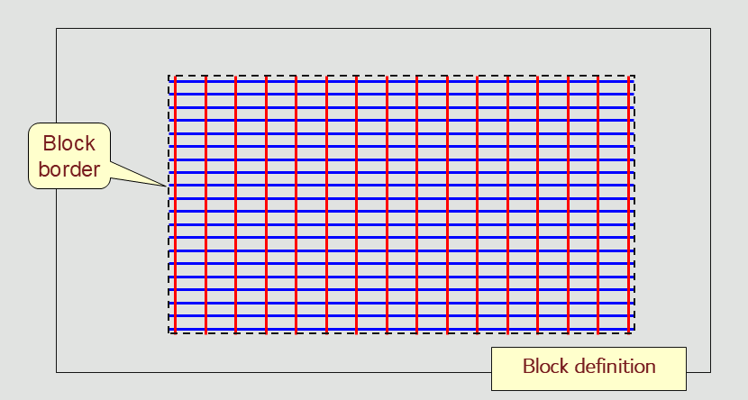

Multiple blocks
---------------

It is possible to have multiple blocks within a single project. The blocks can use different templates.

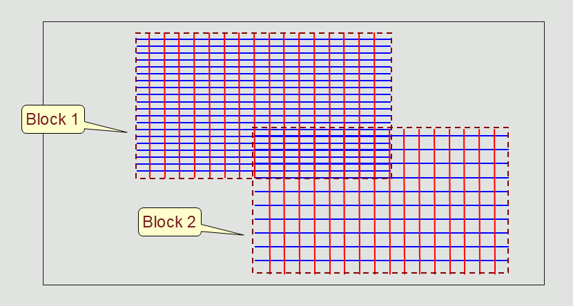

These steps define the basics of the template based structure for a survey design in Roll.

.. note::

   In this example all seeds in a template are able to take part in the roll-along activity.
   There are however also seeds that are stationary in space. These are:

   1. Stationary grid-based seeds
   2. Well trajectory based seeds
   3. Circle based seeds
   4. Spiral based seeds

   These seeds are not affected by the template's roll operation; their position is fully determined by the seed's origin 

Nodal surveys
-------------

In land seismic design, there is a trend towards using **nodal** (*cable-less*) recording.
These nodes continuously acquire seismic data. There is no central recording system where shot records can be displayed and analyzed.
The clock for each independent node is synchronized by GPS. Only when the nodes are collected and data is *harvested* shot records are being reconstituted.

Nodes have become rather cheap to manufacture, and as a consequence the channel count on a seismic crew can be in the tens of thousands.
A shot can be acquired, when all of the nodes needed for the required offsets and azimuths are present. 
By having a large number of nodes (almost) all shots can be recorded at any time.
Effectively, the whole survey design becomes a single template, removing the need to do any roll-along.

Towed marine surveys
--------------------

The opposite end-member to template design is formed by towed streamer surveys.
Here a single source is fired, with a certain streamer configuration towed behind the seismic vessel.

When the next shot is taken, normally using a different source (*think of flip-flop or triple-source shooting*) the vessel has already moved
together with the towed streamer configuration

So, here we have one shot per template, which is rolled inline, and crossline to form half a **racetrack**.
The number of templates in a survey is two (*for each sailline direction*) times the number of race tracks times the number of towed sources.

.. note::

   For Roll the streamer templates are demanding to display, due to the large number of templates with their large overlap. For this reason Level of Detail (LOD) drawing has been implamented, so the GUI stays responsive when zooming in or out.

Racetracks
~~~~~~~~~~

In a marine seismic survey, a racetrack (or racetrack pattern) is a highly efficient navigation strategy
used by a survey vessel to collect data along parallel paths.
Instead of turning immediately into the adjacent parallel line at the end of a path—which is physically difficult and time-consuming—the vessel makes a wide turn and circles back to sail down a different line a few kilometers away.This continuous oval looping resembles a sports racing track,
optimizing both the mechanics of the ship and the quality of the data.

Why the Racetrack Pattern is Used

Equipment Safety:
   Modern 3D seismic vessels tow an immense array of specialized equipment, including seismic sound sources (airguns) and multiple data-recording cables called streamers. These streamers can be up to 9–12 kilometers long and spread hundreds of meters wide. Making sharp, immediate turns would cause the cables to tangle, sink, or snap.

Data Consistency:
   The racetrack pattern allows the vessel to acquire adjacent data strips (swathes) while traveling in the same direction. This consistency eliminates geographic data processing anomalies that occur when trying to stitch together back-and-forth alternating lines.
   
Time and Fuel Efficiency:
   Because the vessel needs a massive turning radius to safely swing its towed equipment around, it cannot simply pivot 180 degrees into the next immediate track. By looping outward to a line further away, the ship avoids "dead time" spent idling or looping aimlessly, keeping the vessel continuously productive

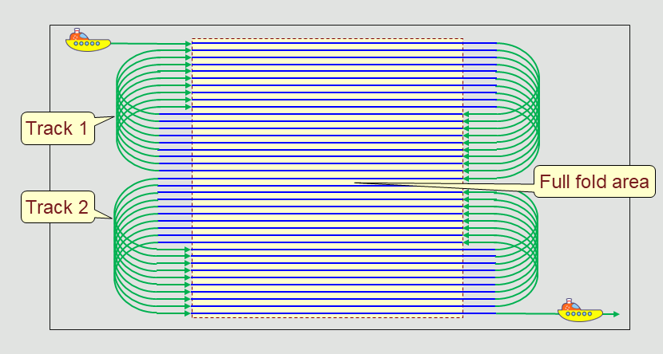

How it Works in Practice
^^^^^^^^^^^^^^^^^^^^^^^^

The Run In:
   The vessel makes sure that sources and streamers are on course towards the pre-planned coordinate line (*sail line*) and starts the sources.

The Sail Line: 
   The vessel records data while moving in a straight path along the pre-planned coordinate line.

The run-out:
   In order to ensure a regular (*flat*) full-fold boundary at the end of the line, the vessels keeps shooting for half a streamer length.

The U-Turn:
   When completeing the run-out, the sources are temporarily powered down. The ship executes a wide, sweeping loop.

The Return Line:
   The ship aligns itself with a new line in the opposite direction (*often several kilometers over from the first line*), activates the sources and heads back towards the survey area.
   
The Interlocking Grid:
   The ship repeats this loop over and over, slowly filling in the missing parallel lines on subsequent passes until a seamless, dense grid of the subsurface has been acquired.

.. note::

   In the middle of a race track, the sail iine direction reverses. The presence of cross-currents can cause deviation (*feathering*) of the streamers and this will lead to gaps in the subsurface coverage
   
.. note::

   To compensate for gaps caused by feathering, additional "infill lines" may be needed.
   
.. note::
   
   By using an **odd** number of sailines in a race track, one can prevent a reversal of the sail line direction between race tracks. This is shown in the above picture, that contains two racetracks, each with 19 saillines.
