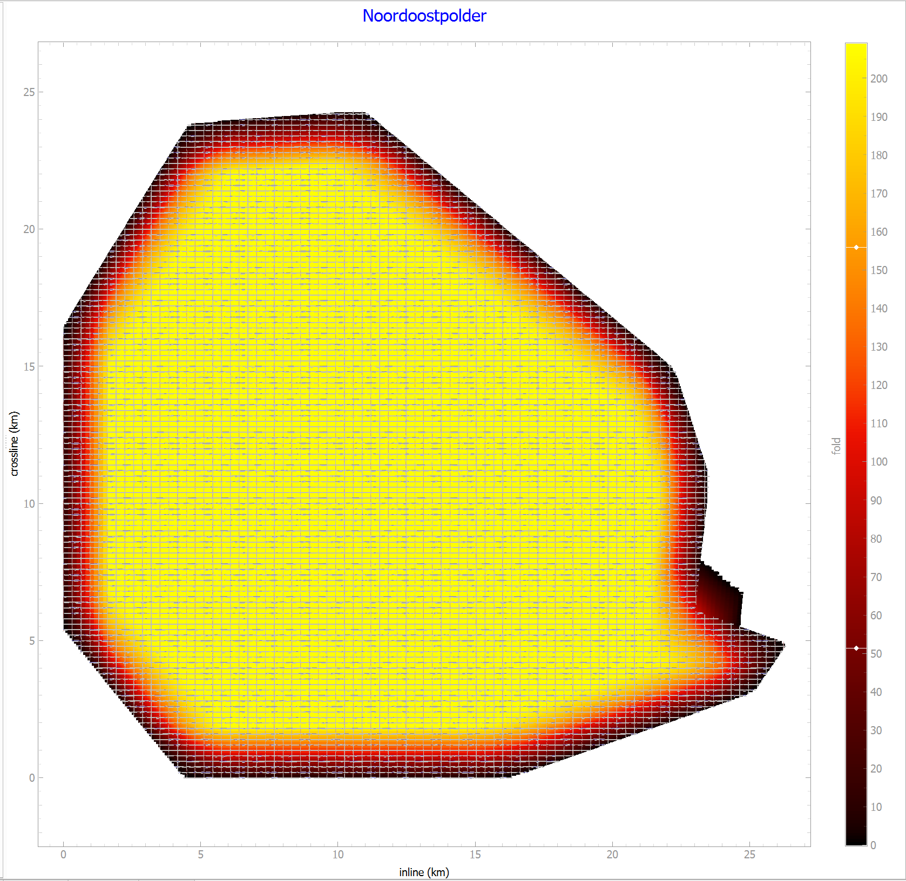
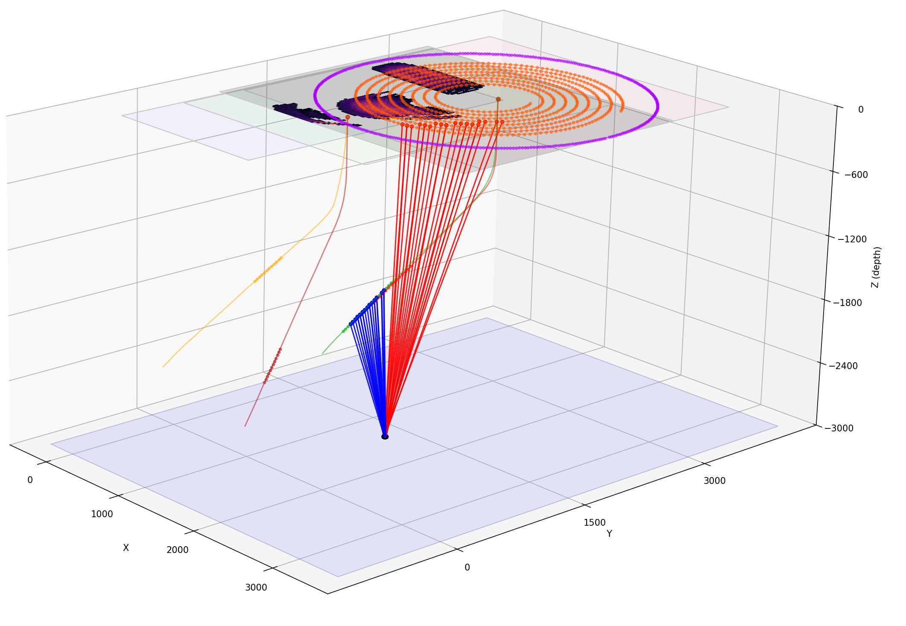

User Guide
==========

Overview
--------

The purpose of **Roll** is to build (*design*) and analyze seismic surveys. At first, using a template based approach, with the help of design wizards.
Once completed, the survey layout can be checked visually in the *Layout* tab, before running some analysis jobs using 'worker threads'.

The template information can be converted into geometry tables, eliminating any source or receiver duplication caused by template overlap.
The geometry tables can then be exported to QGIS, where points can be edited (moved or deleted).
The edited points can be imported back into Roll, for analysis of the edited geometry.

The plugin supports both template-driven survey analysis as well as a geometry-driven analysis. 
The latter can also be based on a set of legacy SPS data files, that can be imported using a variety of column definitions.
The plugin is designed to be used by both experienced GIS users and non-GIS users alike.
It provides a simple interface for defining survey blocks, templates, seeds, patterns, and roll along behavior,
while also offering advanced options for binning analysis from templates or geometry tables.

At a high level, Roll lets you:

* Create a survey project using wizards, or load an existing project;
* Define blocks, templates, seeds, patterns, and roll along behavior;
* Generate geometry tables from the template definition;
* Run binning analysis from templates or geometry tables;
* Inspect analysis outputs inside Roll; and
* Export geometry and raster outputs to QGIS.

Prerequisites
-------------

Roll runs inside QGIS and expects its Python dependencies to be installed in the QGIS Python environment,
typically from the OSGeo4W shell on Windows. Roll has not yet been tested on Linux or MacOS,
but should work on those platforms as well, provided the dependencies are installed in the QGIS Python environment.

.. note::

   It is possible to run Roll independently from QGis. Obviously, interaction with QGis will then be disabled. A batch file has been created for this purpose.
   The batch file is included in the GitHub repository. For security reasons it is not uploaded to the OSGeo Plugins repository. The GitHub repository can be found `here <https://github.com/MrBeee/roll>`__.

Core Concepts
-------------

Roll uses a small set of domain concepts throughout the survey design and file formats.

Block
   A survey consists of one or more rectangular **blocks**. When a survey area has been defined by the interpreter,
   it is always the most efficient to cover the area as a single block.
   The reason for this is that one needs to create a seemless merge (*for the relevant offsets*) at each block boundary.
   Said differently, at a block boundary there will be repeated source and/or receiver effort which brings additional costs.
   In the past the available channel count for a land crew was very limited, and the use of multiple blocks was often unavoidable

Template
   Each block contains one or more **templates**. A template describes how sources and receivers are arranged together before rolling.
   Sources and receivers are defined by seeds and grow lists. Each template requires at least one receiver seed and one source seed to create output traces.
   Templates are discussed in more detail in the template design section.

   .. note::

      A template defines the combination of all receivers that are active for all sources *within the same template*.
      This means that a template with 10 source points and 1,000 receivers will result in 10 x 1,000 = 10,000 output traces.
  
      During processing part of these traces may be filtered out based on binning parameters, but the template definition itself does not have a concept of trace filtering. 

Seed
   A **seed** is the starting location of a source or receiver definition. It is defined using local coordinates (*unless it is part of a well trajectory*)

Grow list
   Each seed can be **grown** up to three times in different directions. These growth steps can therefore turn a point into a line,
   a line into a grid, and a grid into interwoven grids.

Roll list
   The seeds and their grow steps make up a single template. Each template can then be **rolled** in different directions repeating it across the survey area. 
   The roll steps (*maximum three*) are defined in a roll list that is owned by its block.

Geometry tables and SPS data
   Between subsequent templates (*that are being rolled*) there is an enormous **overlap** (*repeating the same points many times*).
   In real life, some points may need to be skipped, and others need to be moved to a different location.
   The **template** based cookie-cutter approach is not very suited for this. 
   
   For this reason, the **geometry** based approach has been developed, whereby each source and receiver point is identified once and added to source-/receiver tables.
   A relation table is being built simultaneously, that keeps track which receivers are active for each shot point.

Template- versus geometry based processing
   Template-based processing is very suited for quick analysis of the nominal (*hypothetical*) survey layout, and keeps the survey definition compact. 
   Templates are ideal to compare different designs, based on quality indicators, such as fold maps and offset maps. The downside of the template approach are twofold:

   1. Source and receiver locations are implicit and not directly editable. They are repeated many times in the survey design due to template overlap
   2. You can't easily represent complex survey layouts that don't fit the cookie cutter approach, such as surveys with a lot of local variation or with non-rectangular geometry.

   Geometry-based processing uses explicit source and receiver locations, whereby each source and receiver position is defined individually, avoiding duplication.
   By running ``Create Geometry from Templates``, tables with unique source and receiver locations are generated as well as a relational file, that preserves which receivers are active for each shot. 
   
   Geometry-based processing is ideal for working with complex survey layouts and for processing that focuses on the actual source and receiver positions, such as trace-table views and spider plots.
   The source and receiver tables can be exported to QGIS, where they can be manipulated (*moved around, inactivated, or deleted*). 
   The edited source and receiver tables can then be re-imported into Roll which is especially useful for QC of the edited source- /receiver points,
   The same approach can also be used for analysis of existing surveys that have been imported using SPS data.

Project files and outputs
-------------------------

Roll project files use the Extensible Markup Language (XML) format and the ``.roll`` file extension. XML is a widely used format for structured data, and has  several advantages:

* It is human-readable and (*if necessary*) can be edited with a text editor directly within Roll's XML pane.
* It supports a hierarchical structure, which is very suitable for representing the nested nature of survey elements such as blocks, templates, seeds, and rolls.
* It allows for the inclusion of metadata, such as the coordinate reference system (CRS) in Well-Known Text (WKT) format, which is essential for geospatial applications.
* It is extensible, allowing for the addition of new elements and attributes as the software evolves, avoiding hassle with version management of project files

Below, the core of the XML structure is illustrated with a simplified example. The actual XML structure includes additional attributes and elements to capture the full range of survey design options and metadata.

.. code-block:: xml

   <block_list>
      <block>
         <name>Block-1</name>
         <borders>
           <src_border xmin="-20000.0" xmax="20000.0" ymin="-20000.0" ymax="20000.0"/>
           <rec_border xmin="0.0" xmax="0.0" ymin="0.0" ymax="0.0"/>
         </borders>
         <template_list>
            <template>
               <name>Template-1</name>
               <roll_list>
                  <translate n="10" dx="0.0" dy="200.0"/>
                  <translate n="10" dx="250.0" dy="0.0"/>
               </roll_list>
               <seed_list>
                  <seed x0="5975.0" src="True" y0="625.0" argb="#77ff0000" typno="0" azi="False" patno="0">
                     <name>Src-1</name>
                     <grow_list>
                        <translate n="1" dx="250.0" dy="0.0"/>
                        <translate n="4" dx="0.0" dy="50.0"/>
                     </grow_list>
                  </seed>
                  <seed x0="0.0" src="False" y0="0.0" argb="#7700b0f0" typno="0" azi="False" patno="1">
                     <name>Rec-1</name>
                     <grow_list>
                        <translate n="8" dx="0.0" dy="200.0"/>
                        <translate n="240" dx="50.0" dy="0.0"/>
                     </grow_list>
                  </seed>
              </seed_list>
            </template>
         </template_list>
      </block>
   </block_list>

Apart from the project file, Roll also generates analysis outputs that are stored alongside the project as binary numpy files, which carry the ``xxx.npy`` extension. 
These outputs include fold maps, offset maps, and other visualizations that are derived from the survey geometry and processing parameters. 
The trace table uses a memory-mapped file so large tables can be worked with incrementally instead of being loaded fully into memory.
Therefore 

Using ``orthogonal_001.roll`` as an example, the full list of numpy analysis files is currently:

.. csv-table::
   :header: "File", "Extension"
   :align: left

   "``Orthogonal_001.roll.ana.npy``", "Memory mapped trace table (*analysis file*)"
   "``Orthogonal_001.roll.azi.npy``", "Azimuth/offset histogram"
   "``Orthogonal_001.roll.bin.npy``", "Binning results (*fold map*)"
   "``Orthogonal_001.roll.cfp.npy``", "CFP based illumination map"
   "``Orthogonal_001.roll.gap.npy``", "Max offset gap map"
   "``Orthogonal_001.roll.max.npy``", "Maximum offset map"
   "``Orthogonal_001.roll.min.npy``", "Minimum offset map"
   "``Orthogonal_001.roll.off.npy``", "Offset histogram"
   "``Orthogonal_001.roll.rms.npy``", "RMS offset gap map"
   "``Orthogonal_001.roll.rec.npy``", "geometry tables: receiver locations"
   "``Orthogonal_001.roll.rel.npy``", "geometry tables: sr/rec relation file"
   "``Orthogonal_001.roll.src.npy``", "geometry tables: source locations"

Main Analysis Outputs
---------------------

Depending on the workflow and the chosen processing mode, Roll produces various analysis plots:

In the **Layout** tab these are

* Analysis area
* fold map
* minimum offsets
* maximum offsets
* rms offset increments
* Max offset gaps
* Illumination regularity map
* Spider plots for individual bins

The **layout** tab contains buttons to export these plots directly to QGis in a georeferenced manner. 
This funcionality is also available from the File -> export menu.

Under the **Analysis** tab, one can find:

* A trace table with all binning results
* Inline / crossline offsets
* Inline / crossline azimuths
* Inline / crossline stack response
* KxKy stack response
* Common Focal Point (CFP) analysis for a single point with:

  * In the spatial (x, y) domain:

    * Source beam
    * Receiver beam
    * Resolution function

  * In the Radon domain:

    * Source beam
    * Receiver beam
    * AVP function

* Offset histogram for the whole analysis area
* Offset / Azimuth diagram for the analysis area

.. note::

   'Full binning' extends the basic outputs with detailed per-trace information such
   as line and stake numbers, source and receiver coordinates, CMP coordinates,
   travel time, offset, azimuth, and unique-fold related values.

Survey Wizards
--------------

Roll provides separate wizards for **land** and **marine** survey design.

Land/OBN Survey Wizard
~~~~~~~~~~~~~~~~~~~~~~

The land/OBN survey wizard supports several geometry types:

1. orthogonal
2. parallel
3. slanted
4. brick
5. zigzag

Marine Survey Wizard
~~~~~~~~~~~~~~~~~~~~

The marine survey wizard is specialized in towed-streamer acquisition. It accounts
for turning-radius constraints and race-track style acquisition planning when
constructing practical survey layouts. 
It tries to optimize race track size to achieve minimal survey duration

Importing SPS Data
------------------

Legacy SPS data can be imported from the file menu and processed in much the
same way as internally generated geometry tables.

Roll ships with predefined SPS dialects and allows users to define and
store additional SPS dialects by adjusting columns used for line number, point
number, northing, and easting. This makes the plugin useful both for survey
design and for QC or re-analysis of existing acquisition data.

Editing Survey Files
--------------------

Roll helps users avoid direct XML editing in almost all cases.

1. New surveys can be created with the land or marine survey wizard.
2. Existing surveys can be modified in the property pane, which updates
   the XML structure behind the scenes.

.. note::

   Advanced users can still edit the XML directly and apply those changes using
   the ``Reload document`` action (Ctrl+F5 from the View menu).

Interaction with QGIS
---------------------

Generated geometry, imported SPS data, and raster analysis products can all be
exported to QGIS. In QGIS, source and receiver points can be moved, deleted, or
marked inactive and then loaded back into Roll for renewed analysis.

   Fold map of the Noordoostpolder example project.

3D View
-------

Roll includes a 3D view for a subset of the survey layout. This is especially
useful when using 'binning against a dipping plane' dipping-plane surveys,
or when using well trajectories, and VSP-style geometry.
Rolling templates are too expensive to render fully in 3D, so the view only allows 
non-rolling seeds and related geometry that are most useful to inspect.

   3D representation of a survey area.

Related Help
------------

For the detailed QGIS editing and round-trip workflow, use the dedicated
:doc:`Roll and QGIS Interface Guide <qgis-interface-guide>` page in the documentation.